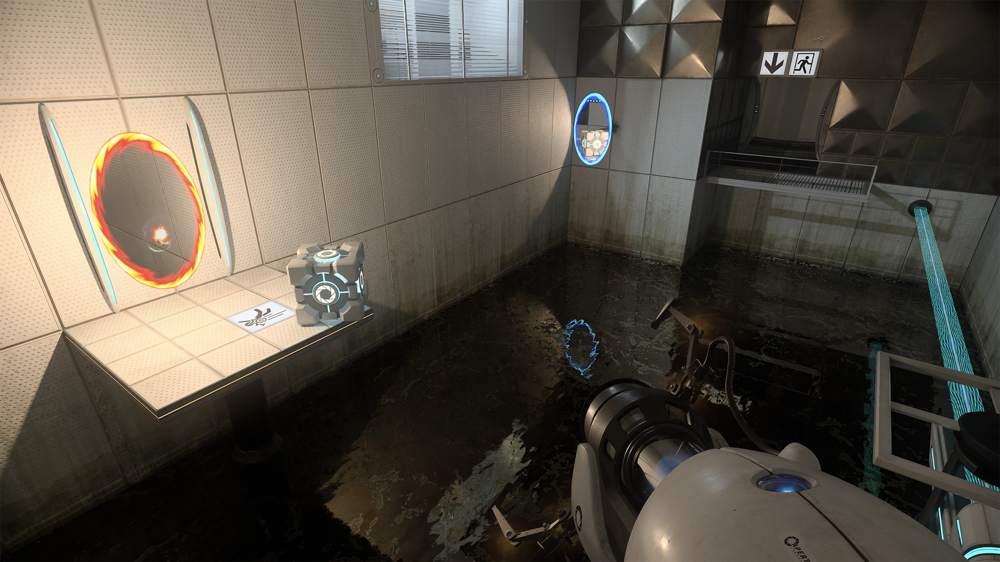

# PAC3_Manovich_Reloaded

## Introducció
- **Nom:** Pol Garriga
- **Data:** 17/12/2024

Aquest projecte examina dos exemples recents d'hibridació, aplicant els principis analítics de Lev Manovich presentats al seu llibre *El software toma el mando*. S'analitzen casos rellevants de **Unreal Engine 5** i les tecnologies de **Ray Tracing** (RTX) de diverses empreses.

---

## Exemple 1: Unreal Engine 5 i la transformació de la creació digital

### **Descripció del projecte**
*Unreal Engine 5* (UE5) és un motor gràfic desenvolupat per Epic Games. És utilitzat en sectors com el cinema, l’arquitectura, la realitat virtual i la publicitat gràcies a les seves capacitats per generar visuals d’alta fidelitat en temps real. Tecnologies com Nanite (per a geometria detallada) i Lumen (il·luminació dinàmica) permeten crear entorns virtuals hiperrealistes i interactius. Des del seu llançament inicial el 2022, UE5 ha evolucionat amb actualitzacions contínues fins a la versió 5.5.

#### **Tecnologies destacades:**
1. **Lumen:** Aquesta tecnologia ofereix il·luminació global dinàmica i reflexos realistes en temps real. Gràcies a Lumen, els creadors poden treballar amb il·luminació interactiva sense necessitat de precalcular-la.
2. **Nanite:** És un sistema de geometria virtualitzada que permet utilitzar milions de polígons sense afectar el rendiment. Això facilita crear models amb un detall extrem, com catedrals, muntanyes, o ciutats senceres, que semblen fotos realistes.
3. **Procedural Content Generation (PCG):** Generació automàtica d'entorns complexos com boscos, ciutats o paisatges naturals amb pocs clics. Aquesta eina és especialment útil per a crear escenaris proceduralment, donant via a crear mons infinits.
4. **Path Tracer:** Una solució de renderitzat físicament precisa per crear imatges cinematogràfiques finals. La versió 5.5 ha optimitzat el rendiment d'aquesta funcionalitat, fent-la més accessible per a produccions de qualsevol mida.
5. **MegaLights:** Aquesta eina permet utilitzar centenars de fonts de llum dinàmiques amb un impacte mínim en el rendiment, obrint noves possibilitats per a dissenyadors d’escenaris complexos.

#### **Casos d'ús destacats:**
- **Cinema:** En produccions com *The Mandalorian*, UE5 ha estat essencial per crear entorns virtuals que substitueixen les pantalles verdes tradicionals. Aquests entorns permeten als actors i directors treballar amb un escenari visible en temps real, millorant la interacció i reduint costos posteriors.
- **Videojocs:** Amb la seva adopció massiva, UE5 ha permès crear títols com *Ark Survival Ascended* i *Hellblade II*, que utilitzen la seva capacitat per generar gràfics hiperrealistes.
- **Arquitectura i disseny:** Empreses utilitzen UE5 per crear visualitzacions interactives d’edificis, permetent als clients explorar els espais abans que s’hagin construït.
- **Educació:** Universitats i institucions inclouen UE5 per ensenyar disseny de jocs, cinema i aplicacions interactives.

### **Anàlisi amb "les ulleres de Manovich"**
- **Principis del programari:** UE5 exemplifica la modularitat i la interoperabilitat, permetent integrar diferents eines i fluxos de treball en una mateixa plataforma. La seva naturalesa de codi obert parcial (Permeten veure el codi pero no es un projecte Open Source) fomenta la cultura de col·laboració i l'aprenentatge entre la comunitat de desenvolupadors, dissenyadors i artistes.
- **Hibridació de mitjans:** Combina tecnologies d'animació 3D, disseny d'entorns, i efectes especials en temps real, barrejant les pràctiques del cinema tradicional amb els jocs i experiències immersives. És una eina transversal que desdibuixa la línia entre el món virtual i el físic, com es veu en produccions com The Mandalorian, on UE5 es va utilitzar per crear entorns virtuals en temps real.
- **Impacte cultural:** Democratitza les eines avançades, permetent que creadors independents produeixin obres d'alta qualitat. També redefineix la narrativa visual a través de la producció virtual i els entorns immersius.

---

## Exemple 2: El Ray Tracing en temps real

### **Descripció del projecte**
El *ray tracing* representa una revolució en el món dels gràfics computacionals. Aquesta tècnica imita com la llum es comporta en el món real, permetent recrear efectes com reflexos naturals, ombres complexes, i refraccions. Durant dècades, aquesta tecnologia estava restringida a la postproducció de cinema per la seva alta demanda computacional. Tanmateix, gràcies a avenços recents en *hardware* i *software*, ara és possible implementar *ray tracing* en temps real, obrint una nova era per a videojocs, disseny industrial, arquitectura, realitat augmentada, simulacions i aplicacions interactives.

#### **Actors principals i tecnologies clau:**
1. **Nvidia RTX:**
   - Amb la introducció de les GPU de la sèrie RTX, Nvidia va liderar la implementació del *ray tracing* en temps real.
   - El *Deep Learning Super Sampling (DLSS)* aprofita la IA per augmentar la resolució i millorar el rendiment, fent possible utilitzar *ray tracing* en equips amb potència limitada.
   - Integració amb motors i aplicacions de disseny com Unreal Engine i Blender.
2. **AMD Radeon Ray Tracing:**
   - AMD ha ampliat el seu suport al *ray tracing* mitjançant les arquitectures RDNA2 i RDNA3, oferint compatibilitat amb DirectX Raytracing (DXR) i Vulkan.
   - Està dissenyat per donar suport a creadors independents, oferint solucions més assequibles que les de Nvidia.
3. **Intel Arc Ray Tracing:**
   - Tot i ser un nouvingut, Intel ha llançat GPU compatibles amb DXR i XeSS, centrant-se en eficiència i rendibilitat.
   - Ofereix una alternativa per a aquells que busquen capacitats de *ray tracing* sense fer una gran inversió.

#### **Aplicacions pràctiques:**
- **Videojocs:** Jocs com *Cyberpunk 2077* i *Minecraft RTX* utilitzen *ray tracing* per oferir entorns més immersius, on les superfícies brillants reflecteixen amb precisió l'entorn.
- **Cinema i publicitat:** Els entorns creats amb *ray tracing* es poden renderitzar en temps real per a vídeos publicitaris o efectes visuals.
- **Simulacions i formació:** Aplicacions d'arquitectura, realitat virtual i disseny industrial aprofiten la precisió de la llum per crear experiències interactives.

### **Anàlisi amb "les ulleres de Manovich"**
- **Principis del programari:** RTX aplica el processament paral·lel per renderitzar gràfics en temps real. Això exemplifica la capacitat del programari per optimitzar processos complexos mitjançant hardware avançat (GPUs). El Deep Learning Super Sampling (DLSS) utilitza IA per millorar la resolució i el rendiment del RTX, mostrant l'hibridació entre computació visual i intel·ligència artificial. Els motors que incorporen *ray tracing* utilitzen processament paral·lel massiu, maximitzant l’eficiència en càlculs visuals complexos.
- **Hibridació de mitjans:** RTX combina aspectes de la cinematografia tradicional (traçat de llum físicament precís) amb l'interactiu (videojocs i aplicacions immersives). Les aplicacions s’estenen a sectors com la publicitat i l’entreteniment.
- **Impacte cultural:** El *ray tracing* ha portat el realisme visual a un nou nivell, redefinint l'experiència en videojocs, produccions cinematogràfiques i simulacions interactives. Aquesta tecnologia hibrida pràctiques de cinematografia amb mitjans interactius.

---

## **Referències i bibliografia**
- [**Epic Games** (2024) *Unreal Engine 5.5 Release Notes*.](https://dev.epicgames.com/documentation/en-us/unreal-engine/unreal-engine-5.5-release-notes) *(Consultat: Desembre de 2024).*
- [**Epic Games** (2024) *Unreal Engine*.](https://www.unrealengine.com) *(Consultat: Desembre de 2024).*
- [**Epic Games** (2024) *Procedural Content Generation Overview*.](https://dev.epicgames.com/documentation/en-us/unreal-engine/procedural-content-generation-overview) *(Consultat: Desembre de 2024).*
- [**Epic Games** (2024) *Path Tracer in Unreal Engine*.](https://dev.epicgames.com/documentation/en-us/unreal-engine/path-tracer-in-unreal-engine) *(Consultat: Desembre de 2024).*
- [**Epic Games** (2024) *MegaLights in Unreal Engine*.](https://dev.epicgames.com/documentation/en-us/unreal-engine/megalights-in-unreal-engine) *(Consultat: Desembre de 2024).*
- [**Unreal Engine YouTube channel** (2021) *Welcome to Unreal Engine 5 Early Access*.](https://www.youtube.com/watch?v=d1ZnM7CH-v4) *(Consultat: Desembre de 2024).*
- [**YouTube** (2024) *Why Unreal Engine 5.5 is a BIG Deal*.](https://www.youtube.com/watch?v=BcmUZpdChhA) *(Consultat: Desembre de 2024).*
- [**Wikipedia** (2024) *Ray tracing (graphics)*.](https://en.wikipedia.org/wiki/Ray_tracing_(graphics)) *(Consultat: Desembre de 2024).*
- [**Nvidia** (2024) *NVIDIA GeForce RTX*.](https://www.nvidia.com/en-us/geforce/rtx/) *(Consultat: Desembre de 2024).*
- [**AMD** (2024) *AMD RDNA™ Architecture*.](https://www.amd.com/es/technologies/rdna.html) *(Consultat: Desembre de 2024).*
- [**Intel** (2022) *What Is Ray Tracing and How Does It Work with Intel® Arc™?*.](https://www.intel.com/content/www/us/en/support/articles/000090081/graphics/intel-arc-dedicated-graphics-family.html) *(Consultat: Desembre de 2024).*